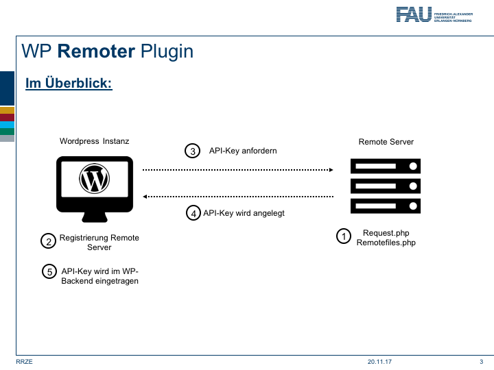

RRZE Remoter
===================

WordPress-Plugin
----------------

Das Remoter Plugin liest die Ordner und die darin enthaltenen Dateien eines Servers aus und gibt die Daten strukturiert (z. B. in einer Tabelle als Links) in Wordpress aus.
Der Zugriff auf die Ordner und Dateien erfolgt eingeschränkt, da hierfür ein API-Key notwendig ist.

### __Grundlegende Funktionsweise des Plugins:__

1. Die Inhalte des Repositories __rrze-remoter-server-files__ (Gitlab)
müssen auf dem Remote-Server im Root-Verzeichnis des Webservers abgelegt werden
2. Der Remote-Server (z. B. zuv.fau.de) muss registiert werden. Dies geschieht im WP-Backend nach der Installation des Plugins.
3. Es muss ein API-Key angefordert werden. 
4. Hierzu muss im WP-Backend der Punkt API-Key Request  aufrufen und die Server-ID eintragen werden.
5. Der API-Key wird im WP-Backend eingetragen
6. Nun können die Daten von einem Remote-Server abgefragt werden.



### __Dateien können auf folgende Möglichkeiten ausgelesen werden:__

- Es wird ein Verzeichnis **rekursiv** ausgelesen.
- Es wird ein Verzeichnis **nicht rekursiv** ausgelesen.
- Es wird **rekursiv nach einen Dateiennamen** gesucht und dieser ausgelesen.

### __Der hierfür benötigte Shortcode beinhaltet folgende Parameter:__

- **id** - Wird bei der Anlage des Remote-Servers automatisch vergeben. (Default leer)
- **file** - Wird lediglich nach einer bestimmten Datei gesucht, so muss hier der Dateiname angeben werden. (Default leer)
- **index** - Das Verzeichnis in dem oder ab welchem gesucht werden soll. (Default leer)
- **recursiv** - Ist dieser werden auf 1, so werden alle Unterverzeichnisse mit durchsucht. Bei 0 wird nur das angegebene Verzeichnis ausgelesen. (Default 1)
- **itemsperpage** - Die Anzahl der Dateien pro Seite. (nur bei view="pagination" relevant!) (Default 5)
- **filetype** - Nach welchen Dateiendungen gesucht wird. (z. B. pdf). Wird der Parameter "all" verwendet, so wird nach folgenden Dateiendungen gesucht (jpg, jpeg, png, tif, gif, txt, doc, docx, xls, xlsx, ppt, pptx, pdf). (Default pdf)
- **link** - Bei link="1" wird der Dateiename verlinkt. (Default 0)
- **alias** - Wird der Parameter "file" verwendet, so kann ein alternativer Anzeigename für den Dateinamen übergeben werden. (Default leer)
- **view**  - Hier wird das Ausgabeformat angegeben. Zur Auswahl stehen (Default table):

```
- die Galerie (gallery), 
- die Tabelle mit Pagination (pagination), 
- eine Tabelle ohne Pagination (view="table" mit showheader=1), 
- eine Tablle mit Html-Header im TinyMCE (view="table" mit showheader=0)
- ein Glossar
```

- **orderby** - Hier kann die Spalte ausgewählt werden nach welcher sortiert wird. (Sortierung möglich für die Spalten: name, size, date) (Default name)
- **order** - Hier kann die Reihenfolge festgelegt werden asc (aufsteigend) oder desc (absteigend). (Default asc)
- **show** - Hier werden die anzuzeigenden Tabellenspalten bestimmt (Default name und download):

```
    -  Dateiname (name),
    -  Download (download),
    -  Dateigröße (size),
    -  Verzeichnisname (directory),
    -  Dateityp (type),
    -  Erstellungsdatum (date)
```

Die Spalten werden genau in der Reihenfolge ausgegeben, wie sie angegeben werden (z. B. show="name,size,directory"

- **showheader** - Falls der Tabellenkopf automatisch erzeugt werden soll (view="table" mit showheader=1). Bei showheader=0 muss der Tabellenkopf selbst über den TinyMCE erzeugt werden. (Default 0)
- **filter** - Eine zusätzliche Möglichkeit das Suchergebnis einzuschränken. Wird filter gesetzt, so müssen auch ein oder mehrere filetypes (z. B. pdf) gesetzt werden. (Default leer)
- **showmetainfo** - Die Ausgabe der .meta.txt Datei wird oberhalb z. B. der Tabelle in einem Accrodion angezeigt und kann ein- (1) und ausgeblendet (0) werden. (Default 1)

### __Beispiele für mögliche Shortcodes:__

 ___für die Galerieansicht:___

[remoter  id=""  index="**images**" filetype="**all**" recursiv="**0**" view="**gallery**"]

Es wird im Verzeichnis images nach den gängisten Dateiformaten (siehe oben) gesucht.

___Tabelle mit Pagination:___

[remoter id="" index="**universitaet**" filter="**englisch**" filetype="**pdf,jpg**" recursiv="**1**" itemsperpage="**1**" view="**pagination**" link="**1**" show="**directory,size,type,date,download,name**" orderby="**size**" order="**asc**"]

Es wird ab dem Verzeichnis univerisitaet rekursiv nach den Dateiformaten (pdf,jpg) gesucht. Da der Filter auf Englisch gesetzt wurde wird nach Dateien mit dem Wort Englisch und dem dem Dateiformat (pdf oder jpg) gesucht.
Pro Seite wird eine Datei angezeigt.
Die Dateinamen werden verlinkt. 
Es werden die Spalten in der Reihenfolge Verzeichnis, Dateigröße, Dateityp, Datum, Download und Dateiname ausgegeben. Das Ergebnis wird nach der Spalte Dateigröße aufsteigend sortiert.

___Tabelle ohne Pagination:___

[remoter id="" index="**universitaet**" filetype="**pdf**" link="**1**" recursiv="**1**" view="**table**" orderby="**name**" show="**name,download,size,directory,date**" order="**asc**" showheader="**1**"]

Es wird ab dem Verzeichnis univerisitaet rekursiv nach allen Dateien mit dem Dateiformat (pdf) gesucht. Die Dateinamen werden verlinkt. Es werden die Spalten in der Reihenfolge Dateiname, Download, Dateigröße, Verzeichnnis und Datum ausgegeben. Das Ergebnis wird nach der Spalte Dateiname aufsteigend sortiert.

___Tabelle mit Html-Header im TinyMCE:___

```
<div>
    <table>
        <tr>
            <th>Dateiname</th>
            <th>Download</th>
        </tr>
        [remoter id="2212879" index="universitaet/organisation/recht/pruefungsordnungen/phil" alias="Testfile" file="Buchwissenschaften 2-Fach-BA 20150815 i.d.F. 20170415 -Aenderungssatzung.pdf"]
        [remoter id="2212879" index="universitaet/organisation/recht/pruefungsordnungen/phil" alias="Testfile2" file="Buchwissenschaften 2-Fach-BA 20150815 i.d.F. 20170415 -konsolidierte Fassung.pdf"]
    </table>
</div>
```

Es wird nach den Dateinamen, welche bei file angegeben wurden rekursiv gesucht. Ausgangspunkt der Suche ist das Verzeichnis im Parameter index. Die Dateinamen werden verlinkt. Es werden die Spalten in der Reihenfolge Dateiname und Download (Default) ausgegeben.

___für den Glossar:___

[remoter id="" index="**universitaet**" filetype="**pdf**" recursiv="**1**" view="**glossary**" link="**1**" show="**download,type,date,size,name,directory**"]

Es wird ab dem Verzeichnis univerisitaet rekursiv nach allen Dateien mit dem Dateiformat (pdf) gesucht. Die Dateinamen werden verlinkt. Es werden die Spalten in der Reihenfolge von show ausgegeben.

### __Ausgabe der Datei .meta.txt:__

In jedem Verzeichnis kann eine Datei mit dem Namen **.meta.txt** hinzugefügt werden. Diese Datei folgt dem **JSON Syntax** und hat eine **vordefinierte Struktur**. Mit der **.meta.txt** lassen sich **kryptische Dateinamen** in der Anzeige vermeiden. So kann jedem Dateinamen ein **alternativer Anzeigename** zugeordnet werden, welcher dann auch angezeigt wird. Darüber hinaus wird oberhalb des jeweiligen Ausgabeformates (z. B. table) ein Accordion mit den JSON-Daten angezeigt. Hier der grundlegende Aufbau der .meta.txt im JSON Syntax:

<pre>
[{
"<b>directory</b>": {
    "<b>titel</b>": "Studienordnungen Buchwissenschaften",
    "<b>beschreibung</b>": "In diesem Verzeichnis sind Studienordnungen für den Studiengang Buchwissenschaften",
    "<b>file-aliases</b>": [{
      "<b>Dateiname</b>": "<b>Anzeigename</b>",
      "Buchwissenschaften_23_5_lb_zb.pdf": "Prüfungsordnung für Buchwissenschaft",
      "":"",
      ...
    }]
  }
}]
</pre>

Wird diesem Format **nicht strikt gefolgt**, so kann die **.meta.txt nicht ausgelesen** werden und dementsprechend keine schönen Anzeigenamen ausgegeben werden. Zur besseren Handhabung mit dem **JSON Sytax** empfielt sich die Installation z. B. des Editors [Visual Studio Code](https://code.visualstudio.com/). Mit diesem kann auf einfach Art und Weise mit dem JSON Sytax gearbeitet werden und ein **Code Highlighting** (in der blauen Fußzeile unten rechts) zur besseren Darstellung eingestellt werden. Alternativ können auch sogenannte Online JSON Formatter und Validator wie [JSON Formatter](https://jsonformatter.curiousconcept.com/) oder [JSON Viewer](https://codebeautify.org/jsonviewer) um nur ein paar, der zahlreich vorhanden aufzuzählen, verwendet werden.

### __Sonstiges__:

Wird eine rekursive Suche durchgeführt, so werden alle .meta.txt Dateien ausgelesen und geordnet nach den Verzeichnissen in einem Accordion oberhalb z. B. der Tabelle angezeigt. Falls ein Verzeichnis keine .meta.txt beinhaltet so ist der Anzeigename gleich dem Dateinamen. Um nicht unötig viele .meta.txt Dateien pflegen zu müssen, bietet sich an im Ausgangsverzeichnis eine einzige .meta.txt anzulegen und auch für die unterhalb dieses Verzeichnis liegende Dokumente einen Dateiennamen mit dem entsprechenden Anzeigenamen zu pflegen.

### __Falls das Plugin gar nicht will - Ruhe bewahren__:

- Überprüfen Sie zunächst einmal den Shortcode und die darin übergebenen Werte.
- Beim JSON-Syntax der .meta.txt hat man sich schnell vertippt. Nutzen Sie stets einen JSON Formatter zur Kontrolle. (siehe oben)
- Viele .meta.txt Dateien bedeuten sehr viel Pflegeaufwand. Legen Sie eine .meta.txt Datei in das Ausgangsverzeichnis. In dieser führen Sie alle Datei- und Anzeigenamen der darunterliegenden Dateien auf.
- __Last but not least__, spielen Sie ein wenig mit dem Plugin. Viel Spass!
